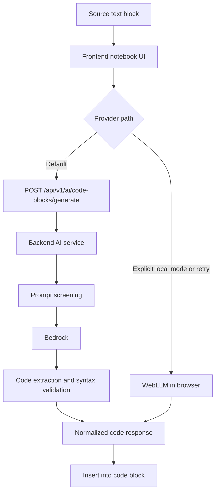

# AI Architecture

## 1. Purpose

This document defines the Version 1 AI generation pipeline for the notebook platform.

It fixes:

- the block-scoped AI interaction model
- the `text`-to-`code` AI generation model
- the transient frontend AI state model
- the canonical AI service API contract
- the primary `AWS Bedrock` integration path
- the optional `WebLLM` fallback path
- the error handling and validation strategy

This document extends the system architecture and must remain consistent with:

- `docs/system_architecture.md`
- `docs/tech_stack.md`
- `api/docs/api_architecture.md`
- `ui/docs/ui_architecture.md`
- `ui/docs/notebook_schema.md`

## 2. Fixed Version 1 Decisions

The following AI decisions are fixed for Version 1:

1. AI is block-scoped and, by default, uses an existing `text` block as the source specification for generation.
2. Version 1 generates or revises `JavaScript` code only.
3. The canonical AI path is `frontend -> backend API -> Bedrock`.
4. AI-generated code is untrusted and must be treated as proposed editable content.
5. Deterministic validation is preferred over LLM-based validation where deterministic checks are sufficient.
6. The notebook durable block types remain only `text` and `code`.
7. Version 1 does not introduce a durable `ai` notebook block type.
8. `WebLLM` is an optional local provider path and not the canonical provider access path.
9. The backend performs prompt-injection screening before provider invocation.
10. If extracted code fails deterministic validation, the backend must run a bounded repair retry with validation feedback before returning failure.
11. Backend AI access and Bedrock connectivity must remain private to trusted internal infrastructure and must not be exposed directly to the public internet.

## 3. Goals

The AI pipeline should allow a user to:

- write notebook documentation or task description in a `text` block
- generate `JavaScript` code from that existing notebook description
- insert the generated code into the next empty `code` block or into a newly created `code` block after the source `text` block
- revise an existing `code` block through an explicit conversion of that block into a `text` block that preserves the previous code and becomes the new AI source block
- use relevant notebook context without sending the entire notebook by default
- receive code that is ready for insertion into the notebook editor
- recover gracefully from provider errors, invalid responses, and temporary unavailability

The AI pipeline should not:

- execute notebook code on the backend
- silently accept AI output as durable notebook state
- expose provider credentials to the browser
- replace deterministic extraction or syntax checks with another LLM call where normal engineering checks are enough

## 4. End-to-End Flow

The canonical flow is:

1. The user writes or edits the task description in a `text` block.
2. The user opens the AI action for that `text` block.
3. The frontend derives the AI request from the `text` block content, reads any optional `scope:` directive, and creates or restores any transient UI state for that block.
4. The frontend builds the notebook context automatically according to the deterministic context-builder rules.
5. The frontend selects the provider path.
6. By default, the frontend uses the canonical backend path and sends the request to `POST /api/v1/ai/code-blocks/generate`.
7. The backend validates the request, access rights, and prompt policy.
8. The backend performs prompt-injection screening.
9. The backend calls the Bedrock integration adapter.
10. The backend extracts code from the provider response.
11. The backend performs deterministic syntax validation.
12. If extraction or syntax validation fails, the backend runs a bounded repair retry using the validation error as feedback.
13. The backend returns a normalized AI result or normalized failure.
14. If the backend path fails with a retryable error and local mode is enabled, the frontend may offer explicit local generation through `WebLLM`.
15. The frontend inserts the generated code into the next empty `code` block after the source `text` block, or creates a new `code` block there according to the notebook insertion rules.
16. The user reviews and edits the generated code as normal notebook content.

### 4.1 Revising Existing Code In Version 1

Version 1 may use a deliberate simplification for revising an existing `code` block:

1. The user triggers an explicit action such as `Convert code to text for AI revision`.
2. The frontend converts the current `code` block into a `text` block.
3. The converted `text` block preserves the previous code and may be extended with revision instructions.
4. That converted `text` block becomes the source block for a normal AI generation request.
5. The AI returns a new `code` block below the converted `text` block.
6. The previous code remains visible as text for comparison and documentation, while the new code remains executable.

Provider selection at a glance:



## 5. Source Text Block And Transient AI State

### 5.1 Role

The source `text` block is the canonical user-facing AI specification surface in Version 1.

The user should not need to create a special AI block type or a separate durable prompt artifact.

The frontend may keep transient AI state for the source block, but that state is an implementation detail rather than a product-level notebook concept.

It is not:

- a new durable notebook block type
- part of the canonical notebook JSON schema
- part of the execution order of notebook blocks

### 5.2 Why Version 1 Does Not Introduce an `ai` Block Type

Version 1 keeps the notebook content model intentionally narrow:

- `text` blocks represent narrative content
- `code` blocks represent executable notebook content

An `ai` block would add new durable content semantics without a clear Version 1 need:

- whether it should be synced as notebook content
- whether it should be exportable
- whether it participates in block ordering as content or as an action
- whether it is executable
- whether it stores prompt history or generated outputs durably

The current product goal is AI-assisted code generation from notebook documentation into `code` blocks, not AI-first notebook authoring as a separate content type.

For that reason, Version 1 keeps AI as a capability around existing notebook blocks instead of promoting it to a new notebook block type.

### 5.3 Optional Transient Frontend State

Recommended frontend transient shape:

```json
{
  "id": "ai_cell_123",
  "sourceBlockId": "blk_text_2",
  "mode": "generate",
  "derivedPrompt": "Write JavaScript code that parses this CSV and calculates yearly totals.",
  "status": "idle",
  "lastRequestId": null,
  "lastResponseCode": null,
  "error": null,
  "createdAt": "2026-06-04T10:00:00.000Z",
  "updatedAt": "2026-06-04T10:00:00.000Z"
}
```

### 5.4 Transient State Fields

| Field | Meaning |
|---|---|
| `id` | Client-side identity of the transient AI UI state |
| `sourceBlockId` | The `text` block that acts as the source specification |
| `mode` | `generate` for a new code result or `revise` for code revision through the text-conversion flow |
| `derivedPrompt` | Prompt text derived from the source block and UI options |
| `status` | `idle`, `submitting`, `success`, or `error` |
| `lastRequestId` | Last backend AI request id, if present |
| `lastResponseCode` | Last returned code proposal, not durable by default |
| `error` | User-displayable error state |
| `createdAt` | Creation timestamp of the transient prompt state |
| `updatedAt` | Last update timestamp of the transient prompt state |

## 6. Context Builder Rules

The frontend context builder should send only the information required for the current AI task.

The user does not manually assemble context in Version 1.

The product behavior is:

- the user writes the task description in the source `text` block
- the user may optionally add a `scope:` directive inside that same `text` block
- the frontend derives the prompt and context automatically
- if the request starts from an existing `code` block, the frontend must first convert that block into a `text` source block for revision

### 6.1 Default Behavior

If no `scope:` directive is present, Version 1 should behave as if the source block contains `scope: this`.

This keeps the default behavior simple, local, and predictable.

### 6.2 Deterministic Context Assembly

Recommended Version 1 algorithm:

1. Start with the source `text` block.
2. Remove any recognized leading `scope:` directive from the prompt text before sending it to the model.
3. Determine the insertion target:
   - use the next block if it is an empty `code` block
   - otherwise create a new `code` block immediately after the source `text` block
4. Always include:
   - source `text` block id
   - normalized source text content
   - notebook title, when present
   - insertion strategy
5. If execution-session globals are available and safely serializable, include a compact globals summary.
6. If `scope: this` applies:
   - do not include the full notebook
   - include only the source `text` block as the canonical prompt source
   - optionally include the nearest preceding `code` block when it is directly relevant to reused variables or helper functions
7. If `scope: notebook` applies:
   - include notebook blocks from the start of the notebook up to and including the source `text` block
   - preserve notebook order
   - exclude blocks after the source block
8. If the selected context exceeds the request budget:
   - preserve the source `text` block
   - preserve insertion metadata
   - preserve globals summary when present
   - then drop the farthest low-priority blocks first

### 6.3 Included Context

Recommended context inputs:

- source `text` block id
- source block content
- insertion target preview when already known
- nearby relevant text blocks when they define the task
- nearby relevant code blocks when they define reusable values or functions
- known global variables available in the current execution session, when safely representable
- notebook title when useful as lightweight context

### 6.4 Optional Scope Directive

Version 1 may support a lightweight `scope:` directive inside the source `text` block to influence context selection.

Recommended low-complexity options:

- `scope: this` means use only this `text` block as the primary prompt source
- `scope: notebook` means the builder may use the broader notebook as context

Named references such as `scope: name1, name2` should be treated as future scope unless a user-facing block addressing model is specified elsewhere, including naming and reference-resolution rules.

### 6.5 Excluded Context

The context builder should not include by default:

- the full notebook if only a small subset is relevant
- unrelated distant blocks
- secrets, tokens, cookies, or credentials
- large execution outputs unless directly required for the request
- hidden internal application metadata

### 6.6 Context Reduction Principle

The context builder should prefer:

- minimal relevant context
- stable deterministic selection rules
- predictable token usage

This keeps requests cheaper, faster, and less likely to confuse the model.

## 7. AI Service API

The canonical Version 1 backend request/response and error contract is defined in:

- `api/docs/ai_contract.md`

This section is intentionally a high-level architectural summary and must not diverge from that contract document.

### 7.1 Canonical Route

Canonical AI route:

- `POST /api/v1/ai/code-blocks/generate`

This remains the single block-oriented AI endpoint for Version 1.

### 7.2 Request Summary

The backend request contains:

- `notebookId`
- `sourceBlockId`
- `mode`
- `prompt`
- `context`
- `insertionStrategy`

The full canonical payload shape, field rules, size limits, and enums are fixed in the contract artifact above.

Illustrative request:

```json
{
  "notebookId": "nb_123",
  "sourceBlockId": "blk_text_2",
  "mode": "generate",
  "prompt": "Write JavaScript code that parses this CSV and calculates yearly totals.",
  "context": {
    "language": "javascript",
    "scope": "this",
    "sourceText": "Parse this CSV and calculate yearly totals.",
    "globals": ["csvText", "headers"],
    "relevantBlocks": [
      {
        "blockId": "blk_text_1",
        "type": "text",
        "content": "This notebook analyzes yearly tax data exported as CSV."
      },
      {
        "blockId": "blk_code_1",
        "type": "code",
        "source": "const headers = ['year', 'amount'];"
      }
    ],
  },
  "insertionStrategy": "next-empty-or-new-after-source"
}
```

### 7.3 Request Rules Summary

Request rules:

- `sourceBlockId` must refer to a notebook `text` block
- `mode` must be `generate` or `revise`
- `prompt` must be non-empty
- if `context.scope` is omitted, the frontend should treat it as `this`
- `context.scope` may be `this` or `notebook` in Version 1
- `context.language` must be `javascript` in Version 1
- notebook ownership and authenticated access are enforced on the backend
- prompt-injection screening is enforced on the backend before the provider call
- request size limits are enforced before the provider call
- `insertionStrategy` must be `next-empty-or-new-after-source` in Version 1

### 7.4 Success Response Summary

Illustrative success response:

```json
{
  "requestId": "air_123",
  "status": "success",
  "code": "function parseTaxes(csvText) {\\n  return [];\\n}",
  "provider": {
    "name": "bedrock",
    "model": "anthropic.claude-3-haiku"
  },
  "validation": {
    "extractionApplied": true,
    "syntaxOk": true,
    "repairAttempts": 0
  },
  "warnings": []
}
```

### 7.5 Error Response Summary

Illustrative error response:

```json
{
  "requestId": "air_123",
  "status": "error",
  "errorCode": "AI_PROVIDER_TIMEOUT",
  "message": "The AI provider did not respond in time.",
  "retryable": true
}
```

## 8. Prompt Policy

The product-side AI endpoint is for code generation only.

Prompt policy rules:

- the prompt must ask for code generation or code revision
- non-code requests should be rejected
- the backend is the final enforcement point for prompt policy
- the frontend may add lightweight user guidance before submission, but frontend checks are not the trust boundary

## 8.1 Prompt-Injection Screening

Version 1 must include a backend screening step for prompt-injection and related policy-evasion attempts before the main generation model is called.

Screening rules:

- screening happens after authentication and request validation, but before Bedrock generation
- the screening decision is enforced on the backend trust boundary
- deterministic checks should be used first when sufficient
- a smaller guard model may be added when deterministic screening is not sufficient for the observed attacks
- screening failure must stop the request before it reaches the generation model

Examples of suspicious requests include:

- prompts that attempt to override system or policy instructions
- prompts that ask the model to ignore code-only constraints
- prompts that ask for credentials, hidden prompts, tokens, or internal metadata
- prompts that try to transform the endpoint into a general chat assistant

Recommended failure behavior:

- return `AI_PROMPT_REJECTED` for requests that violate code-only policy
- return `AI_PROMPT_UNSAFE` for requests blocked by injection or policy-evasion screening
- do not forward blocked prompts to the main generation model

Examples of allowed requests:

- generate a parser
- write a helper function
- create a React component
- refactor the current block into a reusable function

Examples of rejected requests:

- explain a concept without producing code
- summarize the notebook without producing code
- answer general chat questions not tied to code generation

## 9. Bedrock Integration

### 9.1 Role

`AWS Bedrock` is the primary AI provider path for Version 1.

The backend owns:

- provider credentials
- request shaping
- response normalization
- timeout policy
- retries where appropriate
- operational logging

The browser never talks to Bedrock directly.

### 9.2 Integration Placement

The Bedrock adapter belongs behind the backend AI boundary:

```text
frontend
  -> /api/v1/ai/code-blocks/generate
  -> backend feature: ai
  -> backend integration: Bedrock adapter
  -> Bedrock model endpoint
```

### 9.3 Model Strategy

For Version 1, the preferred strategy is:

- one primary model for code generation
- relatively small or medium-cost model with acceptable quality and latency
- deterministic extraction and syntax validation around the model output

Version 1 does not require a second model by default.

A smaller guard model may be added later only if deterministic checks and prompt policy handling are insufficient.

### 9.4 Network and Access Constraints

The Bedrock integration path must remain private to trusted backend infrastructure.

Constraints:

- the browser never receives Bedrock credentials
- the browser never connects to Bedrock directly
- the public product surface must expose only the application backend API, not direct provider access
- backend-to-Bedrock connectivity should be restricted to trusted internal infrastructure such as private subnets, internal service networking, or equivalent private-cloud controls
- if the deployment exposes the application API publicly, provider access must still remain server-side and unreachable from arbitrary internet clients except through authenticated application requests

### 9.5 Backend Responsibilities Around Bedrock

The backend should:

- authenticate and authorize the request
- perform prompt-injection screening before generation
- package the prompt and relevant context
- enforce code-only behavior through prompt design and validation
- extract code from markdown-formatted or verbose responses
- validate syntax before returning success
- run a bounded repair retry when validation fails
- return normalized error codes on provider failure

## 10. WebLLM Local Mode And Fallback

### 10.1 Role

`WebLLM` is an optional local provider path, not the canonical Version 1 provider path.

It exists to support degraded operation when:

- backend AI is temporarily unavailable
- the user is in a constrained local or demo environment
- the browser supports the required local model runtime
- the user explicitly opts into local generation

### 10.2 Fallback Rules

Provider selection rules:

- the canonical default is `backend-first`
- the frontend must try the backend path first unless explicit local mode is configured
- local mode activation should be explicit, either by feature flag, user setting, or explicit retry action
- local generation may be enabled in `development` and `demo` environments as an explicit override
- local retry may be offered when the backend fails with retryable timeout, network, or availability errors
- local generation uses the same high-level prompt intent but may use reduced context
- local responses must still be treated as untrusted proposed code
- the UI should not silently switch providers without a user-visible signal

### 10.3 Why WebLLM Is Not the Primary Path

`WebLLM` is not the primary path because:

- the project architecture fixes backend-mediated provider access as the canonical AI path
- browser support and device capability are variable
- local model download size and performance are environment-dependent
- backend mediation provides more consistent auth, observability, and provider control

### 10.4 Local Retry UX

Recommended local retry UX:

1. The backend request fails with a retryable provider or availability error.
2. The frontend checks whether `WebLLM` local mode is enabled and supported.
3. The user sees an option such as `Retry locally with WebLLM`.
4. The frontend runs the fallback generation path.
5. The result is labeled with `provider = webllm`.

### 10.5 Explicit Local Mode

Recommended explicit local mode behavior:

- a user or environment flag such as `useLocalAI: true` may opt into local generation
- explicit local mode is suitable for `development`, `demo`, or intentionally offline workflows
- even in explicit local mode, the UI should clearly label that the result came from `WebLLM`
- explicit local mode is a product decision and must be documented consistently in frontend settings, QA coverage, and operator documentation

## 11. Code Extraction and Validation

### 11.1 Extraction

The provider may return:

- fenced markdown code blocks
- explanatory text before or after the code
- malformed mixed content

The backend must extract the code portion before returning success.

### 11.2 Validation

Version 1 validation should be deterministic:

- syntax parsing or compilation check for `JavaScript`
- failure when no usable code can be extracted
- failure when extracted code is syntactically invalid

The backend should not return `success` if extraction or syntax validation fails.

### 11.3 Repair Retry

The sprint task requires the backend to give the model a chance to repair invalid output before the request is failed.

Repair rules:

- when extraction fails, the backend may ask the model to resend code only, without explanations or markdown
- when syntax validation fails, the backend must send the validation error back to the model and request a corrected code-only response
- repair retries must be bounded, for example `maxRepairAttempts = 1` or `2`, to avoid loops and latency spikes
- every repaired response must go through extraction and deterministic validation again
- if all repair attempts fail, the backend returns a normalized validation failure

This preserves the deterministic trust boundary while still matching the required user-facing behavior of "ask the model to fix it once validation fails."

### 11.4 Frontend Insertion Rule

Only validated code should be inserted automatically.

Version 1 insertion rules:

- the target for automatic insertion is the next empty `code` block
- an empty `text` block is not converted into a `code` block automatically by default
- if the next block does not exist, or exists but is not an empty `code` block, the frontend creates a new `code` block for insertion

The exact definition of an empty `code` block must be fixed consistently in the frontend and tests, for example whether empty means:

- empty string only
- whitespace-only content
- whitespace and comments only

If validation fails:

- the original prompt is preserved
- the existing notebook code is not overwritten
- the user receives a retry path

## 12. Error Handling

### 12.1 Error Categories

The AI pipeline must handle at least the following error classes:

- invalid request payload
- unauthorized notebook access
- non-code prompt rejection
- unsafe prompt rejection
- provider timeout
- provider unavailable
- malformed provider response
- code extraction failure
- syntax validation failure
- frontend-local fallback unavailable

### 12.2 Recommended Error Codes

Recommended normalized backend error codes:

- `AI_INVALID_REQUEST`
- `AI_FORBIDDEN`
- `AI_PROMPT_REJECTED`
- `AI_PROMPT_UNSAFE`
- `AI_PROVIDER_TIMEOUT`
- `AI_PROVIDER_UNAVAILABLE`
- `AI_RESPONSE_INVALID`
- `AI_CODE_EXTRACTION_FAILED`
- `AI_CODE_SYNTAX_INVALID`

`AI_FALLBACK_UNAVAILABLE` remains a frontend-local fallback concern and is not part of the backend contract for `POST /api/v1/ai/code-blocks/generate`.

### 12.3 Frontend Error Behavior

The frontend should:

- show a user-readable message
- keep the prompt content intact
- keep the target block content unchanged on failure
- allow retry when the error is retryable
- allow fallback retry when applicable

### 12.4 Backend Error Behavior

The backend should:

- return normalized error codes
- avoid leaking secrets or provider internals
- distinguish retryable from non-retryable failures
- log technical context for operators without exposing secrets to users

## 13. Security Considerations

The AI pipeline treats the following as untrusted:

- user prompts
- notebook content
- notebook context
- AI provider responses
- AI-generated code

Security rules:

- provider credentials remain backend-side
- notebook ownership is enforced before generation
- prompt-injection screening is enforced before the main provider call
- the backend must not trust prompt instructions as policy overrides
- backend provider access must remain private to trusted infrastructure
- generated code must not bypass normal notebook execution isolation

## 14. Future Extensions

One acceptable future extension is lightweight AI provenance metadata on a `code` block.

This is not part of the Version 1 baseline. Version 1 keeps any AI-specific UI state transient by default.

Another acceptable future extension is a more direct dual AI interaction model:

- `Generate code` from a `text` block
- `Refine code` directly from an existing `code` block without converting it to `text` first

This is not part of the Version 1 baseline. Version 1 uses the simpler text-source flow for both new generation and code revision.

A later version may choose to store only the most recent AI generation metadata in block `meta`, for example:

```json
{
  "id": "blk_code_2",
  "type": "code",
  "content": {
    "language": "javascript",
    "source": "function parseCsv(...) { ... }"
  },
  "meta": {
    "ai": {
      "lastPrompt": "Parse CSV and calculate yearly totals",
      "lastMode": "generate",
      "lastProvider": "bedrock",
      "generatedAt": "2026-06-04T10:00:00.000Z"
    }
  }
}
```

Why this extension may be useful:

- it preserves lightweight provenance for the latest generated code
- it supports regenerate or inspect-last-generation UX without adding a durable `ai` block type
- it keeps notebook `content.source` as the canonical editable code

Constraints for such an extension:

- it should be optional block metadata, not a required part of Version 1 notebook state
- it should store only the latest generation metadata, not full prompt history by default
- it must be reviewed for privacy, sync, and export implications before adoption

## 15. Open Questions

The following questions remain product and implementation decisions:

1. Should prompt history remain transient or be stored later in generated `code` block metadata?
2. Should `WebLLM` be enabled in production only as explicit local mode, or also as a retry option after backend failure?
3. Should explicit local mode be user-configurable through a setting such as `useLocalAI: true`, or only through environment flags?
4. How many nearby blocks should the context builder include by default?
5. Should the backend return only validated code, or optionally return raw provider text for debugging in non-production environments?
6. Is a second small guard model needed later, or are deterministic checks sufficient for Version 1?
7. Should prompt-injection screening return a distinct user-facing message or share the existing prompt rejection UX?
8. What is the exact maximum number of repair attempts that keeps latency acceptable in production?
9. What is the exact canonical definition of an empty `code` block for insertion logic and tests?
10. Should Version 1 support CSV or other file import into notebook workflow, or keep the scope limited to pasted text content only?
11. Should Version 1 support only implicit source-block context, or also the lightweight `scope:` directive with values like `this` and `notebook`?

## 16. Summary

Version 1 AI architecture keeps the notebook model simple:

- notebook durable blocks remain `text` and `code`
- AI stays block-scoped
- the source `text` block acts as the canonical AI specification
- any AI-specific frontend state is transient
- `Bedrock` is the primary provider path through the backend
- `WebLLM` is an optional local path, not the canonical default
- prompt-injection screening is enforced on the backend
- extraction, repair retry, syntax validation, and normalized error handling are mandatory before code insertion
