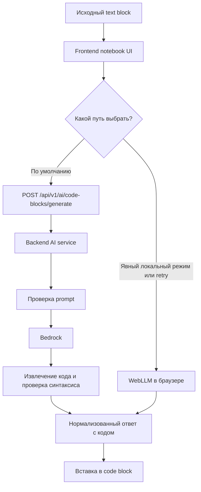

# AI Architecture

> Неканонический русскоязычный companion. Каноническая версия: [ai-architecture.md](./ai-architecture.md).

## 1. Назначение

Этот документ описывает AI-пайплайн Version 1 для notebook-платформы.

Он фиксирует:

- модель AI-взаимодействия, привязанную к конкретному блоку
- модель AI-генерации `text` -> `code`
- модель временного frontend AI-state
- канонический контракт AI service API
- основной путь интеграции через `AWS Bedrock`
- опциональный локальный путь через `WebLLM`
- стратегию обработки ошибок и валидации

Этот документ дополняет общую архитектуру системы и должен оставаться согласованным с:

- `docs/system_architecture.md`
- `docs/tech_stack.md`
- `api/docs/api_architecture.md`
- `ui/docs/ui_architecture.md`
- `ui/docs/notebook_schema.md`

## 2. Зафиксированные решения Version 1

Следующие AI-решения зафиксированы для Version 1:

1. AI работает на уровне отдельного блока и по умолчанию использует существующий `text` block как исходную спецификацию для генерации.
2. Version 1 генерирует или пересобирает только `JavaScript` код.
3. Основной путь работы AI: `frontend -> backend API -> Bedrock`.
4. Сгенерированный AI код считается недоверенным и должен восприниматься как предложенный для редактирования результат.
5. Там, где достаточно обычных технических проверок, они предпочтительнее дополнительной проверки через LLM.
6. В notebook по-прежнему есть только два сохраняемых типа блоков: `text` и `code`.
7. Version 1 не вводит отдельный сохраняемый тип блока `ai`.
8. `WebLLM` является опциональным локальным способом генерации, но не основным путем доступа к модели.
9. Backend проверяет запрос на prompt injection до обращения к основной модели.
10. Если извлеченный код не проходит проверку, backend делает ограниченное число попыток попросить модель исправить ответ.
11. Доступ backend к AI и соединение с Bedrock должны оставаться приватными и не быть напрямую доступны из интернета.

## 3. Цели

AI-пайплайн должен позволять пользователю:

- писать документацию или описание задачи в `text` block
- генерировать `JavaScript` код из этого существующего описания
- вставлять сгенерированный код в следующий пустой `code` block или в новый `code` block после исходного `text` block
- корректировать существующий `code` block через явное преобразование этого блока в `text` block, который сохраняет предыдущий код и становится новым AI source block
- использовать релевантный контекст notebook без отправки всего notebook по умолчанию
- получать код, готовый к вставке в редактор notebook
- устойчиво переживать ошибки провайдера, некорректные ответы и временную недоступность

AI-пайплайн не должен:

- выполнять notebook-код на backend
- молча принимать результат AI как сохраняемое состояние notebook
- раскрывать ключи и учетные данные провайдера в браузер
- заменять обычные проверки извлечения и синтаксиса еще одним вызовом LLM там, где достаточно инженерных проверок

## 4. End-to-End Flow

Основной сценарий работы:

1. Пользователь пишет или редактирует описание задачи в `text` block.
2. Пользователь открывает AI-действие для этого `text` block.
3. Frontend извлекает AI-запрос из содержимого `text` block, читает опциональную директиву `scope:` и создает или восстанавливает служебное временное состояние для этого блока.
4. Frontend автоматически собирает контекст notebook по детерминированным правилам context builder.
5. Frontend выбирает путь работы с моделью.
6. По умолчанию Frontend использует основной backend-path и отправляет запрос в `POST /api/v1/ai/code-blocks/generate`.
7. Backend проверяет корректность запроса, права доступа и соответствие prompt policy.
8. Backend отдельно проверяет запрос на prompt injection.
9. Backend вызывает адаптер Bedrock.
10. Backend извлекает код из ответа модели.
11. Backend проверяет синтаксис кода.
12. Если извлечение или проверка синтаксиса не проходят, backend ограниченно просит модель исправить ответ, передавая ей текст ошибки.
13. Backend возвращает нормализованный успешный результат или нормализованную ошибку.
14. Если основной backend-path падает с временной ошибкой и локальный режим включен, Frontend может предложить явный локальный запуск через `WebLLM`.
15. Frontend вставляет сгенерированный код в следующий пустой `code` block после исходного `text` block или создает там новый `code` block по правилам вставки.
16. Пользователь просматривает и редактирует сгенерированный код как обычный контент notebook.

### 4.1 Корректировка существующего кода в Version 1

В Version 1 для корректировки существующего `code` block может использоваться осознанное упрощение:

1. Пользователь вызывает явное действие вроде `Convert code to text for AI revision`.
2. Frontend преобразует текущий `code` block в `text` block.
3. Преобразованный `text` block сохраняет предыдущий код и при необходимости дополняется инструкцией на изменение.
4. Этот преобразованный `text` block становится исходным блоком для обычного AI-generation request.
5. AI возвращает новый `code` block ниже преобразованного `text` block.
6. Предыдущий код остается видимым как текст для сравнения и документации, а новый код остается исполняемым.

Выбор provider в упрощенном виде:



## 5. Исходный Text Block И Временное AI-Состояние

### 5.1 Роль

Исходный `text` block в Version 1 является канонической пользовательской спецификацией для AI-генерации.

Пользователю не нужно создавать отдельный AI-блок или отдельный сохраняемый prompt-артефакт.

Frontend может хранить временное AI-состояние для исходного блока, но это только техническая деталь реализации, а не отдельная продуктовая сущность notebook.

Он не является:

- новым durable notebook block type
- частью канонической notebook JSON schema
- частью execution order notebook blocks

### 5.2 Почему Version 1 не вводит `ai` Block Type

Version 1 намеренно сохраняет узкую content model notebook:

- `text` blocks представляют narrative content
- `code` blocks представляют executable notebook content

`ai` block добавил бы новую сохраняемую логику контента, хотя для Version 1 в этом пока нет явной необходимости:

- должен ли он синхронизироваться как notebook content
- должен ли он экспортироваться
- участвует ли он в block ordering как content или как action
- является ли он executable
- хранит ли он prompt history или generated outputs durably

Текущая цель продукта — помогать генерировать код из notebook-документации в `code` blocks, а не строить отдельный AI-ориентированный тип контента.

Поэтому Version 1 оставляет AI как capability вокруг существующих notebook-блоков, а не повышает его до нового notebook block type.

### 5.3 Опциональное временное состояние на frontend

Рекомендуемая временная структура на frontend:

```json
{
  "id": "ai_cell_123",
  "sourceBlockId": "blk_text_2",
  "mode": "generate",
  "derivedPrompt": "Write JavaScript code that parses this CSV and calculates yearly totals.",
  "status": "idle",
  "lastRequestId": null,
  "lastResponseCode": null,
  "error": null,
  "createdAt": "2026-06-04T10:00:00.000Z",
  "updatedAt": "2026-06-04T10:00:00.000Z"
}
```

### 5.4 Поля временного состояния

| Поле               | Значение                                                                          |
| ------------------ | --------------------------------------------------------------------------------- |
| `id`               | Идентификатор временного AI UI-state на клиенте                                   |
| `sourceBlockId`    | `Text` block, который выступает исходной спецификацией                            |
| `mode`             | `generate` для нового результата или `revise` для корректировки кода через text-conversion flow |
| `derivedPrompt`    | Текст запроса, полученный из исходного блока и UI-опций                           |
| `status`           | `idle`, `submitting`, `success` или `error`                                       |
| `lastRequestId`    | Идентификатор последнего backend AI request, если есть                            |
| `lastResponseCode` | Последний полученный вариант кода; по умолчанию не сохраняется как часть notebook |
| `error`            | Ошибка, которую можно показать пользователю                                       |
| `createdAt`        | Время создания временного состояния prompt                                        |
| `updatedAt`        | Время последнего обновления временного состояния prompt                           |

## 6. Правила Context Builder

Frontend context builder должен отправлять только ту информацию, которая действительно нужна для текущей задачи генерации.

В Version 1 пользователь не собирает контекст вручную.

Продуктовое поведение такое:

- пользователь пишет описание задачи в исходном `text` block
- пользователь может при необходимости добавить директиву `scope:` в этот же `text` block
- frontend сам строит prompt и context
- если запрос начинается с существующего `code` block, frontend сначала должен преобразовать этот блок в `text` source block для корректировки

### 6.1 Поведение по умолчанию

Если директива `scope:` не указана, Version 1 должна вести себя так, как будто в исходном блоке задано `scope: this`.

Это делает поведение по умолчанию простым, локальным и предсказуемым.

### 6.2 Детерминированная сборка контекста

Рекомендуемый алгоритм для Version 1:

1. Взять исходный `text` block.
2. Убрать из текста prompt распознанную ведущую директиву `scope:`, если она есть.
3. Определить место вставки:
   - использовать следующий block, если это пустой `code` block
   - иначе создать новый `code` block сразу после исходного `text` block
4. Всегда включать:
   - идентификатор исходного `text` block
   - нормализованный текст исходного блока
   - название notebook, если оно есть
   - стратегию вставки
5. Если доступны глобальные переменные execution session и их можно безопасно сериализовать, включать их компактную сводку.
6. Если действует `scope: this`:
   - не включать весь notebook
   - использовать только исходный `text` block как канонический источник prompt
   - опционально включать ближайший предыдущий `code` block, если он прямо нужен для переиспользуемых переменных или helper-функций
7. Если действует `scope: notebook`:
   - включать блоки notebook от начала документа до исходного `text` block включительно
   - сохранять порядок блоков
   - не включать блоки после исходного блока
8. Если выбранный контекст не помещается в бюджет запроса:
   - обязательно сохранять исходный `text` block
   - обязательно сохранять метаданные вставки
   - сохранять сводку globals, если она есть
   - затем отбрасывать сначала самые дальние низкоприоритетные блоки

### 6.3 Включаемый context

Что обычно стоит включать в контекст:

- идентификатор исходного `text` block
- содержимое исходного блока
- предварительное понимание целевого места вставки, если оно уже известно
- ближайшие текстовые блоки, если именно в них описана задача
- ближайшие code blocks, если в них есть переменные, функции или другой код, который нужно переиспользовать
- известные глобальные переменные из текущей execution session, если их можно безопасно и понятно передать в запрос
- название notebook, если оно помогает понять задачу

### 6.4 Опциональная директива scope

Version 1 может поддержать легкую директиву `scope:` внутри исходного `text` block, чтобы управлять выбором контекста.

Низкосложные варианты:

- `scope: this` означает использовать этот `text` block как основной источник prompt
- `scope: notebook` означает, что builder может брать более широкий контекст из notebook

Именованные ссылки вроде `scope: name1, name2` стоит считать future scope, пока в проекте отдельно не определена пользовательская модель адресации блоков, включая правила именования и разрешения ссылок.

### 6.5 Исключаемый context

Что не нужно включать по умолчанию:

- весь notebook, если для генерации нужна только его небольшая часть
- далекие блоки, которые не относятся к текущей задаче
- secrets, tokens, cookies или credentials
- большие результаты выполнения, если они не нужны напрямую для запроса
- скрытые внутренние служебные данные приложения

### 6.6 Принцип сокращения context

Context builder должен придерживаться таких правил:

- передавать минимально достаточный контекст
- использовать понятные и одинаковые правила отбора блоков
- держать объем запроса предсказуемым

Это делает запросы дешевле, быстрее и менее склонными запутывать модель.

## 7. AI Service API

### 7.1 Канонический endpoint

Канонический AI endpoint:

- `POST /api/v1/ai/code-blocks/generate`

Он остается единственным block-oriented AI endpoint для Version 1.

### 7.2 Форма запроса

Рекомендуемая форма запроса:

```json
{
  "notebookId": "nb_123",
  "sourceBlockId": "blk_text_2",
  "mode": "generate",
  "prompt": "Write JavaScript code that parses this CSV and calculates yearly totals.",
  "context": {
    "language": "javascript",
    "scope": "this",
    "sourceText": "Parse this CSV and calculate yearly totals.",
    "globals": ["csvText", "headers"],
    "relevantBlocks": [
      {
        "blockId": "blk_text_1",
        "type": "text",
        "content": "This notebook analyzes yearly tax data exported as CSV."
      },
      {
        "blockId": "blk_code_1",
        "type": "code",
        "source": "const headers = ['year', 'amount'];"
      }
    ],
    "insertion": {
      "strategy": "next-empty-or-new-after-source"
    }
  }
}
```

### 7.3 Правила запроса

Правила запроса:

- `sourceBlockId` должен ссылаться на notebook `text` block
- `mode` должен быть `generate` или `revise`
- `prompt` должен быть непустым
- если `context.scope` не передан, frontend должен трактовать его как `this`
- `context.scope` в Version 1 может быть только `this` или `notebook`
- `context.language` должен быть `javascript` в Version 1
- backend обязательно проверяет, что пользователь имеет доступ к notebook
- backend обязательно проверяет запрос на prompt injection до вызова модели

### 7.4 Форма ответа

Рекомендуемый успешный ответ:

```json
{
  "requestId": "air_123",
  "status": "success",
  "code": "function parseTaxes(csvText) {\\n  return [];\\n}",
  "provider": "bedrock",
  "model": "anthropic.claude-3-haiku",
  "warnings": [],
  "validation": {
    "extractionApplied": true,
    "syntaxOk": true
  }
}
```

### 7.5 Форма ответа с ошибкой

Рекомендуемый ответ с ошибкой:

```json
{
  "requestId": "air_123",
  "status": "error",
  "errorCode": "AI_PROVIDER_TIMEOUT",
  "message": "The AI provider did not respond in time.",
  "retryable": true
}
```

## 8. Prompt Policy

Продуктовый AI endpoint предназначен только для генерации кода.

Правила prompt policy:

- prompt должен запрашивать генерацию кода или доработку кода
- запросы не про код должны отклоняться
- backend является последней и главной точкой проверки prompt policy
- frontend может показывать пользователю подсказки перед отправкой, но доверять только frontend-проверкам нельзя

## 8.1 Prompt-Injection Screening

Version 1 должен включать отдельную backend-проверку на prompt injection и похожие попытки обойти правила до вызова основной модели.

Правила этой проверки:

- проверка выполняется после аутентификации и базовой валидации запроса, но до вызова Bedrock
- итоговое решение по такой проверке принимается на backend
- если достаточно обычных правил и проверок, сначала нужно использовать именно их
- при необходимости позже можно добавить отдельную небольшую модель для защитной проверки
- если проверка не пройдена, запрос не должен уходить в основную модель

Примеры подозрительных запросов:

- prompts, пытающиеся переопределить системные или служебные инструкции
- prompts, просящие модель игнорировать ограничение "только код"
- prompts, просящие учетные данные, скрытые промпты, токены или внутренние данные
- prompts, пытающиеся превратить endpoint в обычный чат

Рекомендуемое поведение при отказе:

- возвращать `AI_PROMPT_REJECTED`, если запрос нарушает правило "только код"
- возвращать `AI_PROMPT_UNSAFE`, если запрос заблокирован как небезопасный или как попытка обойти правила
- не отправлять заблокированные prompts в основную модель

Примеры допустимых запросов:

- generate a parser
- write a helper function
- create a React component
- refactor the current block into a reusable function

Примеры отклоняемых запросов:

- explain a concept without producing code
- summarize the notebook without producing code
- answer general chat questions not tied to code generation

## 9. Интеграция Bedrock

### 9.1 Роль

`AWS Bedrock` — основной путь доступа к AI для Version 1.

Backend отвечает за:

- учетные данные провайдера
- подготовку запроса
- приведение ответов к единому формату
- правила таймаутов
- повторные попытки там, где это уместно
- техническое логирование

Браузер никогда не обращается к Bedrock напрямую.

### 9.2 Размещение интеграции

Адаптер Bedrock находится внутри backend-границы AI:

```text
frontend
  -> /api/v1/ai/code-blocks/generate
  -> backend feature: ai
  -> backend integration: Bedrock adapter
  -> Bedrock model endpoint
```

### 9.3 Стратегия модели

Для Version 1 предпочтительна такая стратегия:

- одна основная модель для генерации кода
- относительно небольшая или недорогая модель с приемлемым качеством и скоростью ответа
- обычное извлечение кода и проверка синтаксиса вокруг ответа модели

Version 1 по умолчанию не требует второй модели.

Отдельная небольшая защитная модель может быть добавлена позже только если обычных проверок и текущих правил prompt policy окажется недостаточно.

### 9.4 Ограничения сети и доступа

Путь интеграции с Bedrock должен оставаться приватным внутри доверенной backend-инфраструктуры.

Ограничения:

- браузер никогда не получает Bedrock credentials
- браузер никогда не подключается к Bedrock напрямую
- публичная часть продукта должна отдавать только backend API приложения, а не прямой доступ к провайдеру
- соединение между backend и Bedrock должно быть ограничено доверенной внутренней инфраструктурой, например приватными подсетями или внутренней сетью сервисов
- даже если API приложения доступно извне, доступ к провайдеру все равно должен оставаться только на стороне сервера и не быть доступен напрямую внешним клиентам

### 9.5 Что должен делать backend вокруг Bedrock

Backend должен:

- аутентифицировать и авторизовывать запрос
- проверять запрос на prompt injection до генерации
- собирать prompt и релевантный контекст
- удерживать поведение "только код" с помощью промпта и валидации
- извлекать код из ответов с Markdown-разметкой или лишними пояснениями
- проверять синтаксис перед возвратом успешного ответа
- делать ограниченное число повторных попыток исправления, когда проверка не пройдена
- возвращать ошибки в едином формате при сбое провайдера

## 10. WebLLM: локальный режим и fallback

### 10.1 Роль

`WebLLM` — это опциональный локальный путь генерации, а не основной путь для Version 1.

Он нужен для упрощенного или резервного режима работы, когда:

- backend AI временно недоступен
- пользователь работает в локальном или demo-окружении
- браузер поддерживает нужный локальный runtime модели
- пользователь явно выбирает локальную генерацию

### 10.2 Правила fallback

Правила выбора провайдера:

- основной режим по умолчанию — `backend-first`
- frontend должен сначала пробовать backend, если явно не включен локальный режим
- локальный режим должен включаться явно: через feature flag, настройку пользователя или отдельное действие retry
- локальная генерация может быть разрешена в `development` и `demo` окружениях как явное исключение
- локальный retry можно предлагать, когда backend падает по таймауту, сети или временной недоступности
- локальная генерация использует тот же общий смысл prompt, но может работать с сокращенным контекстом
- ответы из local mode все равно считаются недоверенным предложенным кодом
- UI не должен незаметно переключать провайдера без явного сигнала пользователю

### 10.3 Почему WebLLM не является основным путем

`WebLLM` не является основным путем, потому что:

- архитектура проекта фиксирует backend-mediated provider access как основной AI path
- browser support и device capability вариативны
- размер локальной модели и ее скорость зависят от окружения
- backend дает более стабильные auth, наблюдаемость и контроль над провайдером

### 10.4 Как выглядит локальный retry

Рекомендуемый сценарий локального retry:

1. Backend-запрос завершается временной ошибкой провайдера или недоступности.
2. Frontend проверяет, включен ли и поддерживается ли локальный режим `WebLLM`.
3. Пользователь видит вариант вроде `Retry locally with WebLLM`.
4. Frontend запускает локальную генерацию.
5. Результат помечается как `provider = webllm`.

### 10.5 Явный локальный режим

Рекомендуемое поведение явного локального режима:

- пользовательская настройка или флаг окружения вроде `useLocalAI: true` может включить локальную генерацию
- такой режим подходит для `development`, `demo` или намеренно offline-сценариев
- даже в этом режиме UI должен явно показывать, что результат пришел из `WebLLM`
- этот режим нужно согласованно описать в настройках frontend, тестах и технической документации

## 11. Извлечение и валидация кода

### 11.1 Извлечение

Модель может вернуть:

- fenced markdown code blocks
- explanatory text до или после кода
- malformed mixed content

Backend должен извлечь именно код до возврата успешного ответа.

### 11.2 Валидация

Валидация в Version 1 должна быть детерминированной:

- syntax parsing или compilation check для `JavaScript`
- ошибка, если не удалось извлечь пригодный для использования код
- ошибка, если извлеченный код синтаксически неверен

Backend не должен возвращать `success`, если извлечение кода или проверка синтаксиса не пройдены.

### 11.3 Repair Retry

Задача спринта требует, чтобы backend дал модели шанс исправить некорректный ответ перед окончательным отказом.

Правила repair:

- когда код не удалось извлечь, backend может попросить модель прислать только код без пояснений и Markdown
- когда проверка синтаксиса не пройдена, backend должен отправить модели текст ошибки и попросить исправленный ответ только с кодом
- число таких повторных попыток должно быть ограничено, например `maxRepairAttempts = 1` или `2`, чтобы избежать циклов и лишних задержек
- каждый исправленный ответ должен снова проходить извлечение кода и проверку
- если все попытки проваливаются, backend возвращает ошибку в едином формате

Это сохраняет надежную границу проверки и одновременно соответствует требованию: если код не прошел проверку, модель нужно попросить исправить ответ.

### 11.4 Frontend insertion rule

Автоматически должен вставляться только код, прошедший проверку.

Правила вставки Version 1:

- целевая точка для автоматической вставки — следующий пустой `code` block
- пустой `text` block по умолчанию не конвертируется автоматически в `code` block
- если следующего block нет, или он существует, но не является пустым `code` block, frontend создает новый `code` block для вставки

Точное определение пустого `code` block должно быть одинаково зафиксировано во frontend и в тестах. Например, пустым может считаться:

- только пустую строку
- содержимое, состоящее только из пробельных символов
- только пробелы и комментарии

Если validation проваливается:

- исходный prompt сохраняется
- существующий код в notebook не перезаписывается
- пользователю предлагается повторить попытку

## 12. Обработка ошибок

### 12.1 Категории ошибок

AI-пайплайн должен обрабатывать как минимум следующие классы ошибок:

- invalid request payload
- unauthorized notebook access
- non-code prompt rejection
- provider timeout
- provider unavailable
- malformed provider response
- code extraction failure
- syntax validation failure
- local fallback unavailable

### 12.2 Рекомендуемые error codes

Рекомендуемые коды ошибок backend:

- `AI_INVALID_REQUEST`
- `AI_FORBIDDEN`
- `AI_PROMPT_REJECTED`
- `AI_PROMPT_UNSAFE`
- `AI_PROVIDER_TIMEOUT`
- `AI_PROVIDER_UNAVAILABLE`
- `AI_RESPONSE_INVALID`
- `AI_CODE_EXTRACTION_FAILED`
- `AI_CODE_SYNTAX_INVALID`
- `AI_FALLBACK_UNAVAILABLE`

### 12.3 Как frontend ведет себя при ошибках

Frontend должен:

- показывать понятное пользователю сообщение
- сохранять содержимое prompt
- не менять содержимое целевого блока при ошибке
- позволять повторную попытку, если ошибка временная
- позволять fallback retry, когда это уместно

### 12.4 Как backend ведет себя при ошибках

Backend должен:

- возвращать ошибки в едином формате
- не раскрывать секреты или внутренние детали провайдера
- различать временные и невременные ошибки
- писать технические подробности в логи для разработчиков, не показывая секреты пользователям

## 13. Security Considerations

AI-пайплайн считает недоверенными следующие вещи:

- user prompts
- notebook content
- notebook context
- AI provider responses
- AI-generated code

Правила безопасности:

- учетные данные провайдера остаются на backend
- право доступа к notebook проверяется до генерации
- проверка на prompt injection выполняется до вызова основной модели
- backend не должен воспринимать инструкции из prompt как способ отменить системные правила
- доступ backend к провайдеру должен оставаться приватным внутри доверенной инфраструктуры
- сгенерированный код не должен обходить обычную изоляцию выполнения notebook-кода

## 14. Future Extensions

Одно из допустимых будущих расширений — легкая AI-метаинформация о происхождении кода в `code` block.

Это не входит в базовую версию V1. В Version 1 любое AI-специфичное UI-состояние по умолчанию остается временным.

Еще одно допустимое будущее расширение — более прямая двухрежимная AI-модель:

- `Generate code` из `text` block
- `Refine code` напрямую из существующего `code` block без предварительного преобразования в `text`

Это не входит в baseline Version 1. В Version 1 для новой генерации и для корректировки кода используется более простой flow с `text` block как источником.

В более поздней версии можно хранить только данные о последней AI-генерации в `block.meta`, например:

```json
{
  "id": "blk_code_2",
  "type": "code",
  "content": {
    "language": "javascript",
    "source": "function parseCsv(...) { ... }"
  },
  "meta": {
    "ai": {
      "lastPrompt": "Parse CSV and calculate yearly totals",
      "lastMode": "generate",
      "lastProvider": "bedrock",
      "generatedAt": "2026-06-04T10:00:00.000Z"
    }
  }
}
```

Почему такое расширение может быть полезно:

- оно сохраняет краткую информацию о происхождении последнего сгенерированного кода
- оно поддерживает повторную генерацию или просмотр последней генерации без введения отдельного сохраняемого `ai` block type
- оно сохраняет `content.source` notebook как канонический редактируемый код

Ограничения для такого расширения:

- это должна быть необязательная метаинформация блока, а не обязательная часть состояния notebook в Version 1
- по умолчанию нужно хранить только данные о последней генерации, а не полную историю prompt
- перед принятием нужно отдельно оценить последствия для privacy, sync и export

## 15. Open Questions

Следующие вопросы еще нужно обсудить и принять по ним решение:

1. Должна ли история prompt оставаться временной, или позже ее стоит хранить в метаинформации сгенерированного `code` block?
2. Должен ли `WebLLM` быть разрешен в production только как явный локальный режим или также как вариант повторной попытки после сбоя backend?
3. Должен ли явный локальный режим настраиваться пользователем через setting вроде `useLocalAI: true`, или только через флаги окружения?
4. Сколько соседних блоков context builder должен включать по умолчанию?
5. Должен ли backend возвращать только проверенный код или в non-production окружениях можно опционально возвращать сырой ответ модели для отладки?
6. Нужна ли позже отдельная небольшая защитная модель, или обычных проверок достаточно для Version 1?
7. Должна ли проверка на prompt injection возвращать отдельное сообщение для пользователя или использовать тот же UX, что и обычное отклонение промпта?
8. Какое максимальное число повторных попыток исправления удерживает задержку на приемлемом уровне в production?
9. Каково точное каноническое определение пустого `code` block для логики вставки и тестов?
10. Должна ли Version 1 поддерживать импорт CSV или других файлов в notebook workflow, или scope должен оставаться ограниченным только вставкой текстового содержимого?
11. Должна ли Version 1 ограничиться неявным контекстом исходного блока, или стоит поддержать легкую директиву `scope:` со значениями вроде `this` и `notebook`?

## 16. Summary

AI-архитектура Version 1 сохраняет notebook-модель простой:

- notebook по-прежнему сохраняет только блоки `text` и `code`
- AI остается привязанным к отдельному блоку
- исходный `text` block является канонической AI-спецификацией
- любое AI-специфичное frontend-state остается временным
- `Bedrock` является основным путем через backend
- `WebLLM` является опциональным локальным путем, а не режимом по умолчанию
- проверка на prompt injection выполняется на backend
- извлечение кода, повторная попытка исправления, проверка синтаксиса и нормализованная обработка ошибок обязательны до вставки кода
