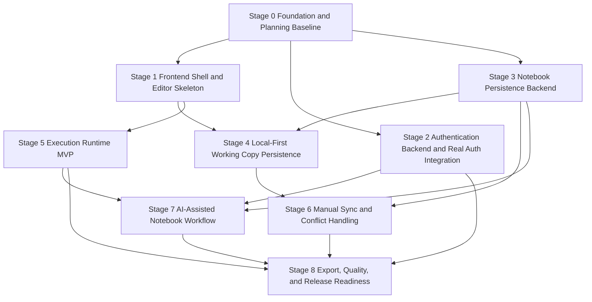

# MVP Roadmap

## Goal

This roadmap describes the major execution stages required to deliver the Version 1 MVP defined in [project.md](../project.md).

It is a planning artifact above task-level specs. Its purpose is to show:

- which major stages make up the MVP
- what each stage unlocks
- which stages block later work
- which areas may proceed in parallel
- how direction-level plans such as [01-auth-backend-plan.md](./01-auth-backend-plan.md) fit into the full product roadmap

This document does not replace task specs in `docs/plans/tasks/`.

## MVP Outcome

The MVP should deliver the core `JavaScript notebook` experience described in [project.md](../project.md):

- sign in
- create and open notebooks
- edit ordered `text` and `code` blocks
- execute `JavaScript` block by block with shared `execution session`
- keep a local working copy and continue offline
- manually sync notebook state with the backend
- use AI to generate or refine code
- export notebook content

## Planning Principles

- Prefer vertical stages that unlock a real capability, not isolated subsystem work.
- Keep architectural contracts fixed while implementation expands underneath them.
- Make blockers explicit so the team knows what is `ready`, what is `parallel`, and what is `blocked`.
- Use direction plans for each stage and task specs for implementation slices.

## Current Repository Reality

Based on the current repository state:

- documentation and architecture are ahead of implementation
- frontend shell and mock editor foundation already exist
- backend `Email + OTP` auth and session flows are implemented and covered by integration tests
- the browser execution runtime is implemented as the current baseline, including the completed live-worker-session follow-up migration
- Google OAuth, notebook persistence backend, sync, AI, export, and full release-readiness are still incomplete as end-to-end product capabilities
- notebook backend and AI backend feature modules are still skeletal

This roadmap therefore starts from the current partial foundation, not from zero.

## Stages

### Stage 0. Foundation and Planning Baseline

**Status**

`mostly done`

**Goal**

Stabilize the canonical docs, local environment, implementation conventions, and initial planning artifacts so feature work proceeds against explicit contracts rather than guesses.

**Unlocks**

- safe implementation planning
- reproducible local development
- task decomposition by direction

**Includes**

- project/system/stack docs
- local Docker/proxy/dev environment
- initial CI scaffold
- direction plans and task specs

**Blocks**

- all later stages depend on this baseline

### Stage 1. Frontend Application Shell and Notebook Editor Skeleton

**Status**

`mostly done`

**Goal**

Establish the real application shell and notebook editing UX in the browser, even if some capabilities are still mock-backed.

**Unlocks**

- visible product surface
- route structure
- notebook editing interactions
- place to integrate auth, persistence, runtime, sync, and AI later

**Includes**

- `/login`, `/notebooks`, `/notebooks/:notebookId`
- notebook list shell
- notebook editor shell
- in-memory block add/edit/delete/reorder

**Blocks**

- downstream frontend integration stages depend on this shell existing

### Stage 2. Authentication Backend and Real Auth Integration

**Status**

`in progress`

**Goal**

Replace mock auth with real backend-managed authentication for Version 1.

**Unlocks**

- real sign-in
- authenticated session bootstrap
- private notebook access foundation
- safe backend identity model for later notebook APIs

**Includes**

- completed:
  - auth persistence and session foundation
  - email OTP request flow
  - OTP verify and session issuance
  - session bootstrap and logout
  - auth integration hardening
- remaining:
  - Google OAuth flow

**Direction plan**

- [01-auth-backend-plan.md](./01-auth-backend-plan.md)

**Blocks**

- real authenticated frontend flows
- backend owner-only notebook access
- realistic release validation

### Stage 3. Notebook Persistence Backend

**Status**

`planned`

**Goal**

Turn notebooks into real durable backend entities with canonical snapshot storage and CRUD behavior.

**Unlocks**

- real notebook list and open flows
- durable server-side notebook state
- revision model required for sync

**Includes**

- notebook persistence models
- notebook CRUD API
- JSONB snapshot storage
- revision metadata
- owner-only notebook access rules

**Blocks**

- real notebook frontend integration
- sync implementation
- export and durable notebook lifecycle

### Stage 4. Local-First Working Copy Persistence

**Status**

`planned`

**Goal**

Implement the browser-side persistence model required for offline-capable notebook work.

**Unlocks**

- reload recovery
- unsynced local changes
- offline editing
- correct local/server state separation

**Includes**

- IndexedDB/Dexie working copy storage
- local notebook metadata
- unsynced state persistence
- restore after reload

**Current note**

The repository already has persistence-related ADRs and auth state persistence in the frontend, but notebook working-copy persistence via `IndexedDB/Dexie` is not implemented yet.

**Blocks**

- complete sync UX
- real local-first behavior required by MVP

### Stage 5. Execution Runtime MVP

**Status**

`done`

**Goal**

Make notebooks executable in the browser with preserved `execution session` and output binding.

**Unlocks**

- core notebook product value
- run block
- run all
- run from selected point

**Includes**

- worker/runtime foundation
- execution orchestrator behavior
- session reset/reuse rules
- outputs: `text`, `object`, `table`, `error`
- chart output support either in this stage or immediately after

**Current note**

Stage 5 core runtime behavior is already implemented.

The later transition from replay-based restoration to a live worker-owned session is also complete and is documented in [04-live-worker-session-transition-plan.md](./04-live-worker-session-transition-plan.md).

That historical artifact should be read as a closed runtime follow-up slice, not as the current next roadmap stage in this MVP sequence.

**Blocks**

- meaningful notebook execution
- realistic AI-assisted code generation validation
- release-ready notebook experience

### Stage 6. Manual Sync and Conflict Handling

**Status**

`planned`

**Goal**

Implement the explicit manual sync model between browser working copy and backend durable state.

**Unlocks**

- real local-first plus backend persistence
- user-visible sync status
- conflict-aware workflow without silent overwrite

**Includes**

- sync endpoint
- `base_revision` check
- `409 Conflict` behavior
- frontend sync status
- explicit conflict UX

**Blocks**

- true MVP local-first behavior
- trustworthy multi-session editing behavior

### Stage 7. AI-Assisted Notebook Workflow

**Status**

`planned`

**Goal**

Implement the AI workflow inside the notebook editing loop, not as detached chat.

**Unlocks**

- prompt to code generation
- regenerate after editing the request
- insert generated code into a selected notebook context

**Includes**

- backend AI endpoint
- frontend prompt flow
- generation/regeneration
- confirm/edit insertion
- execution of generated code in the normal notebook flow

**Blocks**

- full MVP AI capability

### Stage 8. Export, Quality, and Release Readiness

**Status**

`planned`

**Goal**

Harden the product into a coherent MVP that can be reviewed, validated, and released.

**Unlocks**

- trustworthy MVP validation
- cross-layer regression confidence
- portable notebook export

**Includes**

- export to portable notebook JSON
- end-to-end smoke coverage
- auth/sync/runtime regression coverage
- error handling polish
- performance and accessibility checks
- cleanup of docs drift

**Blocks**

- MVP sign-off

## Dependency Graph

## Stage Table

| Stage | Name | Primary Outcome | Depends On | May Run In Parallel With |
|---|---|---|---|---|
| 0 | Foundation and Planning Baseline | Stable contracts and dev baseline | None | 1 planning prep |
| 1 | Frontend Shell and Editor Skeleton | Visible product shell | 0 | 2, 3 |
| 2 | Authentication Backend and Real Auth Integration | Real auth flow except Google OAuth | 0 | 1, 3 |
| 3 | Notebook Persistence Backend | Durable notebook storage | 0, 2 | 1 |
| 4 | Local-First Working Copy Persistence | Offline-capable working copy | 1, 3 | 5 |
| 5 | Execution Runtime MVP | Executable notebook behavior | 1 | 4 |
| 6 | Manual Sync and Conflict Handling | Explicit sync model | 3, 4 | 7 |
| 7 | AI-Assisted Notebook Workflow | In-notebook AI generation flow | 2, 3, 5 | 6 |
| 8 | Export, Quality, and Release Readiness | MVP sign-off readiness | 2, 5, 6, 7 | None |

## Recommended Direction Plans

Direction plans should sit between this roadmap and task-level specs.

Existing:

- [01-auth-backend-plan.md](./01-auth-backend-plan.md)
- [02-notebook-persistence-plan.md](./02-notebook-persistence-plan.md)
- [03-execution-runtime.md](./03-execution-runtime.md)
- [04-live-worker-session-transition-plan.md](./04-live-worker-session-transition-plan.md)

Recommended next direction plans for still-open roadmap areas:

- `docs/plans/03-local-first-persistence-plan.md`
- `docs/plans/04-sync-plan.md`
- `docs/plans/05-ai-integration-plan.md`
- `docs/plans/06-release-readiness-plan.md`

## Recommended Execution Order

Use this as the default delivery order unless a narrower approved task overrides it:

1. finish Stage 0 planning baseline where gaps still exist
2. stabilize Stage 1 shell only as much as needed for integration
3. close the remaining Stage 2 auth scope or explicitly defer `Google OAuth`
4. complete Stage 3 notebook persistence backend
5. implement Stage 4 local-first persistence
6. treat Stage 5 runtime MVP as complete and avoid reopening it unless a new approved runtime task says otherwise
7. implement Stage 6 sync and conflict handling
8. implement Stage 7 AI-assisted workflow
9. finish Stage 8 export and release hardening

## Checkpoints

- [x] After Stages 0-1: the product shell and planning structure are stable enough to support parallel feature work.
- [ ] After Stages 2-3: the backend exposes real auth and notebook persistence boundaries.
- [ ] After Stages 4-6: the core local-first notebook loop works with durable sync.
- [ ] After Stage 7: AI works inside the normal notebook editing flow.
- [ ] After Stage 8: MVP flows are testable end-to-end and ready for sign-off.

## How To Use This Roadmap

- Use this file to decide what direction is next and what is blocked.
- Use direction plans to break a stage into milestone-level implementation slices.
- Use `docs/plans/tasks/*.md` for agent-ready execution tasks.
- Update this roadmap when a stage changes status, when a new direction plan appears, or when architecture changes alter dependencies.
