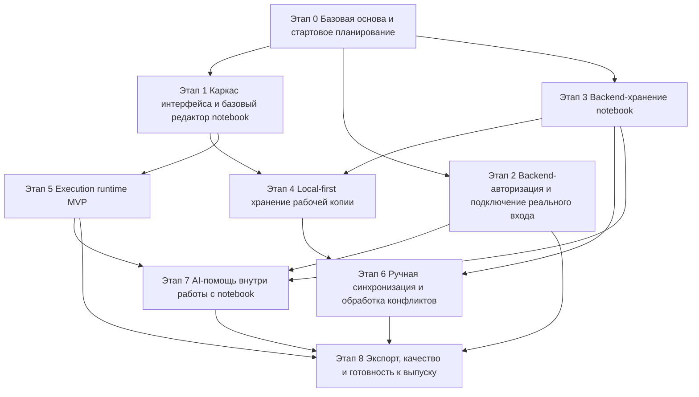

# MVP Roadmap

## Цель

Этот документ описывает основные этапы работ, которые нужны для получения MVP версии 1, определённого в [project.md](./project.md).

Это план верхнего уровня. Его задача показать:

- из каких крупных этапов состоит MVP
- какой результат даёт каждый этап
- какие этапы блокируют следующие
- какие направления можно вести параллельно
- как планы по отдельным направлениям, например [01-auth-backend-plan.md](./01-auth-backend-plan.md), встраиваются в общий план разработки продукта

Этот документ не заменяет подробные задачи в `docs/plans/tasks/`.

## Итоговый результат MVP

MVP должен дать основной сценарий работы с `JavaScript notebook`, описанный в [project.md](./project.md):

- вход в систему
- создание и открытие notebook
- редактирование упорядоченных `text` и `code` блоков
- выполнение `JavaScript` по блокам с общей `execution session`
- локальную рабочую копию и возможность продолжать работу без сервера
- ручную синхронизацию состояния notebook с backend
- использование AI для генерации или доработки кода
- экспорт содержимого notebook

## Принципы планирования

- Предпочитать вертикальные этапы, которые открывают реальную возможность для пользователя, а не изолированную работу по подсистемам.
- Держать архитектурные контракты фиксированными, пока под ними развивается реализация.
- Явно показывать блокировки, чтобы команда понимала, что уже можно брать в работу, что можно делать параллельно, а что пока заблокировано.
- Использовать планы по направлениям для каждого этапа и подробные задачи для исполнимых частей работы.

## Текущее состояние репозитория

По текущему состоянию репозитория:

- документация и архитектура опережают реализацию
- каркас интерфейса и макет редактора уже существуют
- backend `Email + OTP` auth и session flow уже реализованы и покрыты integration tests
- браузерный execution runtime уже реализован как текущий baseline, включая завершённую follow-up миграцию на live worker session
- `Google OAuth`, backend-хранение notebook, sync, AI, export и полная release-readiness ещё не завершены как сквозные продуктовые возможности
- backend-модули для notebook и AI пока всё ещё в основном скелетные

Поэтому этот план начинается не с нуля, а с уже существующей частичной базы.

## Этапы

### Этап 0. Базовая основа и стартовое планирование

**Статус**

`mostly done`

**Цель**

Стабилизировать основные документы, локальную среду, общие правила реализации и стартовые артефакты планирования, чтобы дальнейшая работа шла по явным контрактам, а не по догадкам.

**Что открывает**

- безопасное планирование реализации
- воспроизводимую локальную среду разработки
- декомпозицию работ по направлениям

**Что включает**

- документы по продукту, архитектуре и стеку
- локальную Docker/proxy/dev среду
- базовый каркас CI
- планы по направлениям и подробные задачи

**Что блокирует**

- все последующие этапы зависят от этой основы

### Этап 1. Каркас интерфейса и базовый редактор notebook

**Статус**

`mostly done`

**Цель**

Собрать реальный каркас приложения и базовый сценарий редактирования notebook в браузере, даже если часть возможностей пока работает через заглушки.

**Что открывает**

- видимый пользовательский интерфейс продукта
- структуру маршрутов
- базовые действия редактирования notebook
- место для дальнейшей интеграции auth, хранения, выполнения кода, синхронизации и AI

**Что включает**

- `/login`, `/notebooks`, `/notebooks/:notebookId`
- каркас списка notebook
- каркас редактора notebook
- добавление, изменение, удаление и перестановка блоков в памяти

**Что блокирует**

- все следующие этапы интеграции интерфейса зависят от существования этого каркаса

### Этап 2. Backend-авторизация и подключение реального входа

**Статус**

`in progress`

**Цель**

Заменить учебную или тестовую auth-заглушку на реальную backend-managed авторизацию для Version 1.

**Что открывает**

- реальный вход в систему
- восстановление auth-сессии
- основу для приватного доступа к notebook
- безопасную модель пользовательской идентичности на backend для следующих notebook API

**Что включает**

- уже выполнено:
  - основа для хранения auth-данных и сессий
  - запрос OTP по email
  - проверка OTP и создание сессии
  - восстановление сессии и выход
  - доводка и стабилизация интеграции auth
- осталось:
  - сценарий Google OAuth

**План по направлению**

- [01-auth-backend-plan.md](./01-auth-backend-plan.md)

**Что блокирует**

- реальные сценарии входа в интерфейсе
- backend-доступ к notebook только для владельца
- реалистичную проверку продукта перед выпуском

### Этап 3. Notebook persistence backend

**Статус**

`planned`

**Цель**

Превратить notebooks в реальные сохраняемые сущности на backend с каноническим snapshot-хранением и обычными CRUD-операциями.

**Что открывает**

- реальные сценарии списка и открытия notebook
- долговременное состояние notebook на сервере
- модель revision, необходимую для синхронизации

**Что включает**

- модели хранения notebook
- notebook CRUD API
- JSONB snapshot storage
- метаданные revision
- правила доступа только для владельца

**Что блокирует**

- реальную интеграцию notebook на стороне интерфейса
- реализацию синхронизации
- экспорт и полноценный жизненный цикл notebook

### Этап 4. Local-first хранение рабочей копии

**Статус**

`planned`

**Цель**

Реализовать браузерную модель хранения, которая нужна для работы с notebook без постоянного доступа к серверу.

**Что открывает**

- восстановление после перезагрузки страницы
- локальные несинхронизированные изменения
- редактирование без сервера
- корректное разделение локального и серверного состояния

**Что включает**

- хранение рабочей копии в IndexedDB/Dexie
- локальные метаданные notebook
- сохранение несинхронизированного состояния
- восстановление после перезагрузки страницы

**Текущее примечание**

В репозитории уже есть ADR и заготовки вокруг persistence, а также persistence auth-состояния во frontend, но хранение рабочей копии notebook через `IndexedDB/Dexie` ещё не реализовано.

**Что блокирует**

- полноценный пользовательский сценарий синхронизации
- настоящее local-first поведение, обязательное для MVP

### Этап 5. Execution runtime MVP

**Статус**

`done`

**Цель**

Сделать notebooks исполняемыми в браузере с сохранением `execution session` и привязкой результатов к блокам.

**Что открывает**

- ключевую ценность notebook как продукта
- run block
- run all
- run from selected point

**Что включает**

- основу worker/runtime
- поведение execution orchestrator
- правила сброса и повторного использования session
- outputs: `text`, `object`, `table`, `error`
- поддержку chart output либо в этом этапе, либо сразу после него

**Текущее примечание**

Базовое runtime-поведение Stage 5 уже реализовано.

Более поздний переход от replay-based восстановления состояния к live worker-owned session тоже завершён и зафиксирован в [06-live-worker-session-transition-plan.md](./06-live-worker-session-transition-plan.md).

Этот исторический артефакт нужно читать как закрытый follow-up slice по runtime, а не как следующий активный этап в текущей MVP-последовательности.

**Что блокирует**

- полноценное выполнение notebook-кода
- реалистичную проверку AI-assisted генерации кода
- готовый к выпуску опыт работы с notebook

### Этап 6. Ручная синхронизация и обработка конфликтов

**Статус**

`planned`

**Цель**

Реализовать явную ручную модель синхронизации между рабочей копией в браузере и долговременным состоянием на backend.

**Что открывает**

- настоящее local-first поведение вместе с backend-хранением
- видимый пользователю статус синхронизации
- сценарий работы с конфликтами без тихой перезаписи данных

**Что включает**

- sync endpoint
- `base_revision` check
- `409 Conflict` behavior
- статус синхронизации в интерфейсе
- явный пользовательский сценарий конфликта

**Что блокирует**

- полноценное MVP local-first поведение
- надёжное поведение при работе из нескольких сессий

### Этап 7. AI-помощь внутри работы с notebook

**Статус**

`planned`

**Цель**

Реализовать AI-сценарий внутри цикла работы с notebook, а не как отдельный чат в стороне.

**Что открывает**

- генерацию кода по запросу
- повторную генерацию после изменения запроса
- вставку сгенерированного кода в выбранный контекст notebook

**Что включает**

- backend AI endpoint
- сценарий ввода запроса в интерфейсе
- генерацию и повторную генерацию
- подтверждение, редактирование и вставку результата
- выполнение сгенерированного кода в обычном сценарии работы с notebook

**Что блокирует**

- полную AI-возможность в MVP

### Этап 8. Экспорт, качество и готовность к выпуску

**Статус**

`planned`

**Цель**

Довести продукт до состояния целостного MVP, который можно проверять, принимать и выпускать.

**Что открывает**

- надёжную проверку MVP
- уверенность в отсутствии регрессий между слоями
- переносимый экспорт notebook

**Что включает**

- экспорт в переносимый notebook JSON
- сквозные smoke-проверки
- регрессионное покрытие для auth, sync и runtime
- доработку обработки ошибок
- проверки производительности и доступности
- устранение расхождений в документации

**Что блокирует**

- финальное принятие MVP

## Граф зависимостей

## Таблица этапов

| Этап | Название | Основной результат | Зависит от | Можно вести параллельно с |
|---|---|---|---|---|
| 0 | Базовая основа и стартовое планирование | Стабильные контракты и базовая среда разработки | Нет | 1, предварительное планирование |
| 1 | Каркас интерфейса и базовый редактор notebook | Видимый каркас продукта | 0 | 2, 3 |
| 2 | Backend-авторизация и подключение реального входа | Реальный auth-сценарий, кроме Google OAuth | 0 | 1, 3 |
| 3 | Backend-хранение notebook | Долговременное хранение notebook | 0, 2 | 1 |
| 4 | Local-first хранение рабочей копии | Рабочая копия с поддержкой offline | 1, 3 | 5 |
| 5 | Execution runtime MVP | Выполнение notebook-кода | 1 | 4 |
| 6 | Ручная синхронизация и обработка конфликтов | Явная модель синхронизации | 3, 4 | 7 |
| 7 | AI-помощь внутри работы с notebook | Генерация кода внутри notebook | 2, 3, 5 | 6 |
| 8 | Экспорт, качество и готовность к выпуску | Готовность к финальному принятию MVP | 2, 5, 6, 7 | Нет |

## Рекомендуемые планы по направлениям

Планы по направлениям должны находиться между этим roadmap и подробными задачами.

Уже есть:

- [01-auth-backend-plan.md](./01-auth-backend-plan.md)
- [02-notebook-persistence-plan.md](./02-notebook-persistence-plan.md)
- [05-execution-runtime.md](./05-execution-runtime.md)
- [06-live-worker-session-transition-plan.md](./06-live-worker-session-transition-plan.md)

Далее рекомендуется добавить для ещё открытых областей roadmap:

- `docs/plans/03-local-first-persistence-plan.md`
- `docs/plans/04-sync-plan.md`
- `docs/plans/05-ai-integration-plan.md`
- `docs/plans/06-release-readiness-plan.md`

## Рекомендуемый порядок выполнения

Если более узкая согласованная задача не задаёт другой порядок, использовать такой порядок работ:

1. закрыть оставшиеся пробелы в этапе 0
2. стабилизировать этап 1 ровно настолько, насколько это нужно для дальнейшей интеграции
3. закрыть оставшийся scope этапа 2 или явно отложить `Google OAuth`
4. завершить этап 3 по backend-хранению notebook
5. реализовать этап 4 по local-first хранению
6. считать этап 5 по runtime уже завершённым и не переоткрывать его без новой отдельно утверждённой runtime-задачи
7. реализовать этап 6 по синхронизации и конфликтам
8. реализовать этап 7 по AI-помощи
9. завершить этап 8 по экспорту, качеству и готовности к выпуску

## Checkpoints

- [x] После этапов 0-1: каркас продукта и структура планирования достаточно стабильны для параллельной feature-разработки.
- [ ] После этапов 2-3: backend даёт реальные границы для auth и хранения notebook.
- [ ] После этапов 4-6: основной local-first сценарий notebook работает вместе с надёжной синхронизацией.
- [ ] После этапа 7: AI работает внутри обычного сценария редактирования notebook.
- [ ] После этапа 8: сценарии MVP проверяются сквозным образом и готовы к финальному принятию.

## Как использовать этот roadmap

- Использовать этот файл, чтобы понимать, какое направление следующее и что сейчас заблокировано.
- Использовать планы по направлениям, чтобы раскладывать этап на более мелкие части реализации.
- Использовать `docs/plans/tasks/*.md` для подробных задач, готовых к выполнению агентом или инженером.
- Обновлять этот roadmap, когда меняется статус этапов, появляется новый план по направлению или архитектурные изменения влияют на зависимости.
