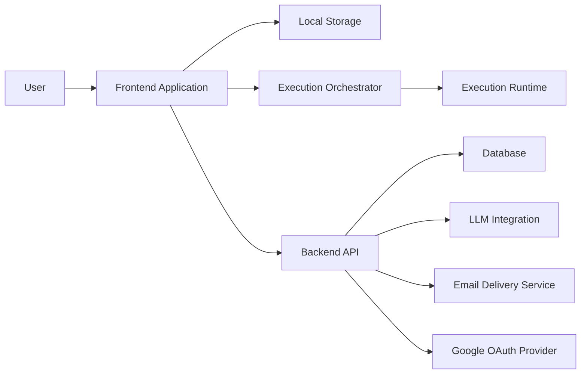

# System Architecture

## 1. Purpose

This document describes the system architecture of the notebook platform.

It fixes:

- the main system components
- the boundaries between them
- the main runtime flows
- the main integration points
- the canonical data directions for Version 1

## 2. Architectural Constraints

The system is built under the following architectural constraints:

1. The main document model is an ordered notebook made of blocks.
2. The main supported executable language is `JavaScript`.
3. Notebook editing must work with local persistence and offline continuation.
4. Synchronization with backend storage is explicit and user-initiated.
5. Code execution is isolated from the control plane.
6. AI is part of notebook editing flow and updates notebook blocks directly.
7. Frontend and backend are separate applications with clear contracts between them.
8. Private notebook access is enforced through authenticated backend-controlled access.
9. The product is delivered as a hosted web application with local-first behavior.
10. Notebook code executes in the browser runtime, while the backend remains the storage, auth, and integration plane.

## 3. Fixed Version 1 Decisions

The following architecture decisions are fixed for Version 1:

1. The execution runtime is `client-side`.
2. The execution orchestrator is `frontend-side`.
3. AI provider access is mediated by the `Backend API`.
4. The canonical notebook format is structured `JSON`.
5. The only notebook block types in Version 1 are `text` and `code`.
6. `text`, `object`, `table`, `chart`, and `error` are output types, not block types.
7. Runtime outputs are execution artifacts and are not part of durable notebook state by default.
8. Synchronization conflicts are handled explicitly without automatic merge.
9. Authenticated browser state uses a backend-managed secure `HTTP-only` session cookie.
10. The Version 1 export format is portable notebook `JSON`.
11. Authentication supports both `Email + OTP` and `Google OAuth`.

## 4. System Composition

The product is accessed as a web application in the browser and keeps local-first editing behavior during notebook work.

The product consists of the following main parts:

| Component | Role |
|---|---|
| `Frontend Application` | Notebook UI, editing, sync UI, execution UI, AI interaction UI |
| `Local Storage` | Browser-side persistent working copy and sync-related local metadata |
| `Execution Orchestrator` | Execution control, ordering, session lifecycle, output binding |
| `Execution Runtime` | Isolated `JavaScript` execution environment |
| `Backend API` | Authentication, notebook persistence, sync API, access control, integrations |
| `Database` | Durable server-side storage |
| `LLM Integration` | AI code generation and refinement |
| `Email Delivery Service` | External OTP delivery for authentication |
| `Google OAuth Provider` | External identity provider for browser sign-in |

## 5. System Context

## 6. Component Responsibilities

### 6.1 Frontend Application

The frontend application is responsible for:

- notebook list UI
- notebook editor UI
- authentication entry UI for email OTP and Google sign-in
- block creation, editing, deletion, and reordering
- rendering text, code, and output areas
- sync state presentation
- user actions such as `sync`, `run block`, `run all`, and `run from here`
- requesting AI assistance for a selected block
- receiving generated code and showing it inside the notebook

The frontend owns the active working copy during editing.

### 6.2 Local Storage

Local storage is responsible for:

- storing the local working copy of notebooks
- preserving unsynced edits
- preserving notebook state across reloads
- storing local sync metadata

In Version 1, local persistence is implemented in browser storage and is a core part of the product behavior, not an optional cache layer.

### 6.3 Execution Orchestrator

The execution orchestrator is responsible for:

- translating user run commands into execution steps
- determining execution order
- starting and resetting execution sessions
- binding outputs to the correct blocks
- surfacing execution progress and errors to the frontend

The execution orchestrator is part of the frontend-side application logic.

### 6.4 Execution Runtime

The execution runtime is responsible for:

- isolated execution of notebook `JavaScript`
- preserving execution session state between block runs
- returning normalized outputs
- separating executable notebook code from application control logic

In Version 1, the runtime is client-side and is controlled through the execution orchestrator.

### 6.5 Backend API

The backend API is responsible for:

- authentication
- OTP issuance and verification
- Google OAuth flow handling
- authenticated session issuance
- notebook persistence
- notebook retrieval
- sync endpoints
- access control
- AI integration endpoints
- operational endpoints such as health checks

The backend API is the server-side boundary of the system.

### 6.6 Database

The database stores durable server-side data:

- users
- authentication-related records
- OAuth account links
- notebooks
- block data
- notebook metadata
- sync metadata

The database is the durable source of truth for server-side notebook state.

### 6.7 LLM Integration

The LLM integration is responsible for:

- turning user prompts into code proposals
- refining existing code for a selected block
- returning code that is immediately insertable into the notebook

In Version 1, access to the LLM provider is mediated by the backend API.

### 6.8 Email Delivery Service

The email delivery service is responsible for:

- delivering one-time passwords for authentication
- acting as an external integration used by the backend API

## 7. Data Ownership and Sources of Truth

| Concern | Primary owner | Notes |
|---|---|---|
| Authenticated identity | `Backend API + Database` | Identity is created and verified server-side |
| Authenticated session lifecycle | `Backend API` | Backend issues and validates the secure session cookie; frontend uses authenticated session state |
| OTP issuance and verification | `Backend API + Database` | Email delivery is external, verification is internal |
| Google OAuth-linked external identity | `Backend API + Database` | Backend maps the external provider identity to the internal user identity |
| Active notebook working copy | `Frontend Application + Local Storage` | Used for editing and offline work |
| Durable notebook state | `Backend API + Database` | Server-side persisted state after sync |
| Block order | `Frontend Application` during editing, `Backend API + Database` after sync | Shared through sync |
| Block content | `Frontend Application` during editing, `Backend API + Database` after sync | Shared through sync |
| Execution session state | `Execution Runtime` | Not the same as durable notebook content |
| Current block outputs | `Execution Runtime` | Frontend presents and binds outputs to blocks |
| Sync status metadata | `Frontend Application + Local Storage + Backend API` | Needed on both sides |
| Access control rules | `Backend API` | Enforced server-side |
| AI provider credentials | `Backend API` | Not exposed to notebook code |
| AI-generated code inserted into a block | `Frontend Application` | Becomes normal editable notebook content after insertion |

## 8. Core System Flows

### 8.1 Open Notebook

1. The user opens a notebook in the frontend.
2. The frontend loads the local working copy from local storage.
3. The frontend loads or refreshes server state through the backend API when needed.
4. The frontend shows the notebook and its sync status.

### 8.2 Edit Notebook

1. The user edits notebook metadata or block content.
2. The frontend updates the active working copy.
3. The updated notebook is persisted locally.
4. The notebook remains locally editable regardless of immediate backend availability.

### 8.3 Execute Code

1. The user runs one block, all blocks, or a range starting from a selected block.
2. The frontend sends the command to the execution orchestrator.
3. The execution orchestrator runs the selected sequence in the execution runtime.
4. The runtime preserves execution session state between related block runs.
5. The runtime returns outputs.
6. The frontend attaches outputs to the correct blocks.

### 8.4 Manual Sync

1. The frontend detects that the local working copy differs from the synchronized server copy.
2. The UI shows that the notebook has unsynced changes.
3. The user triggers sync explicitly.
4. The frontend sends notebook data and sync metadata to the backend API.
5. The backend persists the new durable state.
6. If the backend detects a sync conflict, it returns a conflict response instead of performing automatic merge.
7. The frontend updates the local sync state or shows explicit conflict state that requires a user decision.

### 8.5 AI-Assisted Block Update

1. The user selects a target code block or creates a new target block.
2. The user writes an AI request.
3. The frontend sends the request and relevant notebook context to the backend AI endpoint.
4. The backend requests code generation from the LLM integration.
5. The generated code is returned to the frontend.
6. The frontend inserts the generated code into the selected block as a proposed update.
7. The user confirms, edits, or replaces the inserted code.
8. The resulting block remains a normal editable notebook block.

### 8.6 Authenticate User with Email OTP

1. The user enters an email address.
2. The frontend requests an OTP through the backend API.
3. The backend creates the OTP and triggers delivery through the email service.
4. The user enters the OTP.
5. The backend verifies the OTP.
6. The backend creates the authenticated session and sets the secure `HTTP-only` session cookie.
7. The frontend continues in authenticated state.

### 8.7 Sign in with Google

1. The user chooses Google sign-in in the frontend.
2. The frontend starts the Google OAuth flow through the backend API.
3. The backend redirects the user to the Google OAuth provider.
4. The Google OAuth provider returns the verified identity result to the backend callback.
5. The backend resolves or creates the internal user identity and authenticated session.
6. The backend sets the secure `HTTP-only` session cookie.
7. The frontend continues in authenticated state.

### 8.8 Export Notebook

1. The user requests export.
2. The frontend gathers the notebook content in export format.
3. The system produces a portable notebook `JSON` artifact.

## 9. Cross-Cutting Constraints

### 9.1 Security

- notebook code is untrusted
- AI-generated code is untrusted
- execution is isolated
- backend credentials remain server-side
- access control is enforced by the backend API

### 9.2 Reliability

- unsynced work is preserved locally
- synchronization is explicit
- sync state is visible to the user
- notebook editing continues without constant backend availability

### 9.3 Maintainability

- frontend, backend, runtime, and storage stay separated by clear responsibilities
- contracts between frontend and backend stay explicit
- durable notebook state stays separated from execution session state

### 9.4 Performance

- notebook editing stays responsive
- execution feedback is visible
- output rendering stays attached to block-level execution

## 10. Canonical Data Formats

The system uses the following canonical formats in Version 1:

### 10.1 Notebook Format

Notebook content is stored and transferred as structured `JSON`.

The notebook model contains:

- notebook identity and metadata
- notebook-level `tags`
- ordered blocks
- sync-related metadata

### 10.2 Block Format

Each block has:

- stable block identifier
- explicit block type
- block content
- block-level metadata

In Version 1, block-level metadata includes `tags`.

Version 1 block types:

- `text`
- `code`

### 10.3 Text Block Format

Text blocks store content as `Markdown`.

Text blocks must also carry `meta.tags` as a list of tags.

### 10.4 Code Block Format

Code blocks store content as executable `JavaScript` source.

Code blocks must also carry `meta.tags` as a list of tags.

### 10.5 Runtime Output Format

Runtime outputs are normalized as structured data with:

- output type
- output payload
- metadata needed to bind the output to a block

The primary output types are:

- `text`
- `object`
- `table`
- `chart`
- `error`

Runtime outputs are not part of durable notebook state by default.

### 10.6 Sync Payload Format

Synchronization payloads use structured `JSON` containing:

- notebook content
- notebook identity
- sync metadata

### 10.7 Export Format

Version 1 export uses a portable `JSON` notebook export format.

By default, the export contains notebook content and notebook metadata, not execution output snapshots.

## 11. Related Documents

- [project.md](./project.md)
- [projectRU.md](./projectRU.md)
- [Local-Proxy.md](./Local-Proxy.md)
