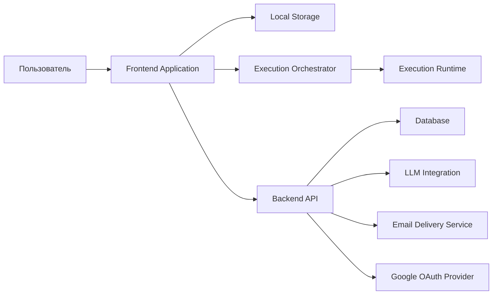

# Архитектура системы

## 1. Назначение

Этот документ описывает системную архитектуру notebook-платформы.

В нем фиксируются:

- основные системные компоненты
- границы между ними
- основные runtime-сценарии
- основные интеграционные точки
- канонические направления данных для Version 1

## 2. Архитектурные ограничения

Система строится при следующих архитектурных ограничениях:

1. Основная модель документа — упорядоченный notebook из блоков.
2. Основной поддерживаемый исполняемый язык — `JavaScript`.
3. Редактирование notebook должно работать с локальной персистентностью и продолжением работы offline.
4. Синхронизация с backend-хранилищем является явной и запускается пользователем.
5. Выполнение кода изолировано от control plane.
6. AI является частью notebook workflow и обновляет notebook-блоки напрямую.
7. Frontend и backend — это отдельные приложения с явными контрактами между ними.
8. Приватный доступ к notebook обеспечивается аутентификацией и backend-controlled access.
9. Продукт поставляется как hosted web application с local-first поведением.
10. Notebook-код выполняется в browser runtime, а backend остается слоем хранения, аутентификации и интеграций.

## 3. Зафиксированные решения для Version 1

Для Version 1 зафиксированы следующие архитектурные решения:

1. Execution runtime является `client-side`.
2. Execution orchestrator является `frontend-side`.
3. Доступ к AI provider идет через `Backend API`.
4. Канонический формат notebook — структурированный `JSON`.
5. Единственные типы notebook-блоков в Version 1 — `text` и `code`.
6. `text`, `object`, `table`, `chart` и `error` — это типы output, а не типы блоков.
7. Runtime outputs являются execution artifacts и по умолчанию не входят в durable notebook-state.
8. Конфликты синхронизации обрабатываются явно, без автоматического merge.
9. Аутентифицированное browser-state использует backend-managed secure `HTTP-only` session cookie.
10. Формат экспорта для Version 1 — переносимый notebook `JSON`.
11. Аутентификация поддерживает и `Email + OTP`, и `Google OAuth`.

## 4. Состав системы

Продукт открывается как web application в браузере и сохраняет local-first поведение во время работы с notebook.

Продукт состоит из следующих основных частей:

| Компонент | Роль |
|---|---|
| `Frontend Application` | Notebook UI, редактирование, sync UI, execution UI, AI interaction UI |
| `Local Storage` | Browser-side персистентная рабочая копия и локальные sync-метаданные |
| `Execution Orchestrator` | Управление выполнением, порядком запуска, жизненным циклом session и привязкой output |
| `Execution Runtime` | Изолированная среда выполнения `JavaScript` |
| `Backend API` | Аутентификация, notebook persistence, sync API, access control, integrations |
| `Database` | Долговременное server-side хранилище |
| `LLM Integration` | AI-генерация и уточнение кода |
| `Email Delivery Service` | Внешняя доставка OTP для аутентификации |
| `Google OAuth Provider` | Внешний identity provider для browser sign-in |

## 5. Системный контекст

## 6. Ответственность компонентов

### 6.1 Frontend Application

Frontend-приложение отвечает за:

- UI списка notebook
- UI редактора notebook
- UI входа через email OTP и Google sign-in
- создание, редактирование, удаление и перестановку блоков
- рендеринг текста, кода и output-областей
- отображение состояния синхронизации
- пользовательские действия `sync`, `run block`, `run all` и `run from here`
- запрос AI-помощи для выбранного блока
- получение сгенерированного кода и показ его внутри notebook

Frontend владеет активной рабочей копией во время редактирования.

### 6.2 Local Storage

Local storage отвечает за:

- хранение локальной рабочей копии notebook
- сохранение несинхронизированных изменений
- сохранение notebook-state между reload
- хранение локальных sync-метаданных

В Version 1 локальная персистентность реализуется в browser storage и является частью поведения продукта, а не опциональным cache-layer.

### 6.3 Execution Orchestrator

Execution orchestrator отвечает за:

- перевод пользовательских команд запуска в шаги выполнения
- определение порядка выполнения
- запуск и сброс execution session
- привязку outputs к правильным блокам
- возврат статуса выполнения и ошибок во frontend

Execution orchestrator является частью frontend-side application logic.

### 6.4 Execution Runtime

Execution runtime отвечает за:

- изолированное выполнение notebook `JavaScript`
- сохранение execution session state между запусками блоков
- возврат нормализованных outputs
- отделение исполняемого notebook-кода от application control logic

В Version 1 runtime является client-side и управляется через execution orchestrator.

### 6.5 Backend API

Backend API отвечает за:

- аутентификацию
- выдачу и проверку OTP
- обработку Google OAuth flow
- создание аутентифицированной session
- персистентность notebook
- получение notebook
- sync endpoints
- access control
- AI integration endpoints
- operational endpoints, например health checks

Backend API является server-side границей системы.

### 6.6 Database

База данных хранит долговременные server-side данные:

- пользователей
- записи, связанные с аутентификацией
- связи с внешними OAuth-аккаунтами
- notebook
- block data
- notebook metadata
- sync metadata

База данных является долговременным источником истины для server-side notebook-state.

### 6.7 LLM Integration

LLM integration отвечает за:

- преобразование пользовательских prompts в предложения по коду
- уточнение существующего кода для выбранного блока
- возврат кода, который можно сразу вставить в notebook

В Version 1 доступ к LLM provider идет через backend API.

### 6.8 Email Delivery Service

Email delivery service отвечает за:

- доставку one-time passwords для аутентификации
- работу как внешняя интеграция, используемая backend API

## 7. Владение данными и источники истины

| Область | Основной владелец | Примечания |
|---|---|---|
| Аутентифицированная идентичность | `Backend API + Database` | Идентичность создается и проверяется server-side |
| Жизненный цикл аутентифицированной session | `Backend API` | Backend выдает и проверяет secure session cookie; frontend использует authenticated session state |
| Выдача и проверка OTP | `Backend API + Database` | Email-доставка внешняя, verification внутренняя |
| Внешняя идентичность, привязанная через Google OAuth | `Backend API + Database` | Backend связывает identity провайдера с внутренней user identity |
| Активная рабочая копия notebook | `Frontend Application + Local Storage` | Используется для редактирования и offline-работы |
| Долговременное состояние notebook | `Backend API + Database` | Server-side persisted state после sync |
| Порядок блоков | `Frontend Application` во время редактирования, `Backend API + Database` после sync | Передается через sync |
| Контент блоков | `Frontend Application` во время редактирования, `Backend API + Database` после sync | Передается через sync |
| Состояние execution session | `Execution Runtime` | Не равно долговременному notebook-контенту |
| Текущие block outputs | `Execution Runtime` | Frontend показывает и привязывает outputs к блокам |
| Метаданные sync-state | `Frontend Application + Local Storage + Backend API` | Нужны на обеих сторонах |
| Правила access control | `Backend API` | Применяются server-side |
| Credentials AI-провайдера | `Backend API` | Не раскрываются notebook-коду |
| AI-сгенерированный код, вставленный в блок | `Frontend Application` | После вставки становится обычным редактируемым notebook-контентом |

## 8. Основные системные сценарии

### 8.1 Открытие notebook

1. Пользователь открывает notebook во frontend.
2. Frontend загружает локальную рабочую копию из local storage.
3. Frontend получает или обновляет server-state через backend API, когда это нужно.
4. Frontend показывает notebook и его sync-state.

### 8.2 Редактирование notebook

1. Пользователь редактирует метаданные notebook или контент блоков.
2. Frontend обновляет активную рабочую копию.
3. Обновленный notebook сохраняется локально.
4. Notebook остается локально редактируемым независимо от немедленной доступности backend.

### 8.3 Выполнение кода

1. Пользователь запускает один блок, все блоки или диапазон начиная с выбранного блока.
2. Frontend передает команду в execution orchestrator.
3. Execution orchestrator выполняет выбранную последовательность в execution runtime.
4. Runtime сохраняет execution session state между связанными запусками блоков.
5. Runtime возвращает outputs.
6. Frontend привязывает outputs к правильным блокам.

### 8.4 Manual Sync

1. Frontend определяет, что локальная рабочая копия отличается от синхронизированной серверной копии.
2. UI показывает, что у notebook есть несинхронизированные изменения.
3. Пользователь явно запускает sync.
4. Frontend отправляет notebook-данные и sync-метаданные в backend API.
5. Backend сохраняет новое долговременное состояние.
6. Если backend обнаруживает sync-конфликт, он возвращает conflict response вместо автоматического merge.
7. Frontend обновляет локальный sync-state или показывает явный conflict state, требующий решения пользователя.

### 8.5 AI-assisted обновление блока

1. Пользователь выбирает целевой code block или создает новый целевой блок.
2. Пользователь пишет AI-запрос.
3. Frontend отправляет запрос и релевантный notebook-контекст в backend AI endpoint.
4. Backend запрашивает генерацию кода у LLM integration.
5. Сгенерированный код возвращается во frontend.
6. Frontend вставляет сгенерированный код в выбранный блок как предложенное обновление.
7. Пользователь подтверждает, редактирует или заменяет вставленный код.
8. Получившийся блок остается обычным редактируемым notebook-блоком.

### 8.6 Аутентификация пользователя через Email OTP

1. Пользователь вводит email.
2. Frontend запрашивает OTP через backend API.
3. Backend создает OTP и инициирует доставку через email service.
4. Пользователь вводит OTP.
5. Backend проверяет OTP.
6. Backend создает аутентифицированную session и устанавливает secure `HTTP-only` session cookie.
7. Frontend продолжает работу в аутентифицированном состоянии.

### 8.7 Вход через Google

1. Пользователь выбирает вход через Google во frontend.
2. Frontend запускает Google OAuth flow через backend API.
3. Backend перенаправляет пользователя к Google OAuth provider.
4. Google OAuth provider возвращает подтвержденный результат identity в backend callback.
5. Backend создает или находит внутреннюю user identity и аутентифицированную session.
6. Backend устанавливает secure `HTTP-only` session cookie.
7. Frontend продолжает работу в аутентифицированном состоянии.

### 8.8 Экспорт notebook

1. Пользователь запрашивает экспорт.
2. Frontend собирает notebook-контент в export format.
3. Система формирует переносимый notebook `JSON` artifact.

## 9. Сквозные ограничения

### 9.1 Безопасность

- notebook-код является недоверенным
- AI-сгенерированный код является недоверенным
- выполнение является изолированным
- backend credentials остаются server-side
- access control применяется backend API

### 9.2 Надежность

- unsynced work сохраняется локально
- синхронизация является явной
- sync-state видим пользователю
- редактирование notebook продолжается без постоянной доступности backend

### 9.3 Поддерживаемость

- frontend, backend, runtime и storage разделены по четким зонам ответственности
- контракты между frontend и backend остаются явными
- durable notebook-state отделено от execution session state

### 9.4 Производительность

- редактирование notebook остается отзывчивым
- feedback по выполнению видим
- рендеринг output остается привязанным к block-level execution

## 10. Канонические форматы данных

Система использует следующие канонические форматы в Version 1:

### 10.1 Формат notebook

Notebook-контент хранится и передается как структурированный `JSON`.

Модель notebook содержит:

- identity и metadata notebook
- notebook-level поле `tags`
- упорядоченные blocks
- sync-related metadata

### 10.2 Формат блока

Каждый block содержит:

- стабильный block identifier
- явный block type
- block content
- block-level metadata

В Version 1 block-level metadata включает `tags`.

Типы блоков в Version 1:

- `text`
- `code`

### 10.3 Формат текстового блока

Text blocks хранят контент как `Markdown`.

Text blocks также должны содержать `meta.tags` как список тегов.

### 10.4 Формат code block

Code blocks хранят контент как исполняемый исходный код `JavaScript`.

Code blocks также должны содержать `meta.tags` как список тегов.

### 10.5 Формат runtime output

Runtime outputs нормализуются как структурированные данные с:

- output type
- output payload
- metadata, нужной для привязки output к блоку

Основные output types:

- `text`
- `object`
- `table`
- `chart`
- `error`

Runtime outputs по умолчанию не являются частью durable notebook-state.

### 10.6 Формат sync payload

Sync payloads используют структурированный `JSON`, содержащий:

- notebook content
- notebook identity
- sync metadata

### 10.7 Формат экспорта

Version 1 export использует переносимый `JSON` notebook export format.

По умолчанию экспорт содержит notebook-контент и notebook metadata, но не execution output snapshots.

## 11. Связанные документы

- [project.md](./project.md)
- [projectRU.md](./projectRU.md)
- [Local-Proxy.md](./Local-Proxy.md)
